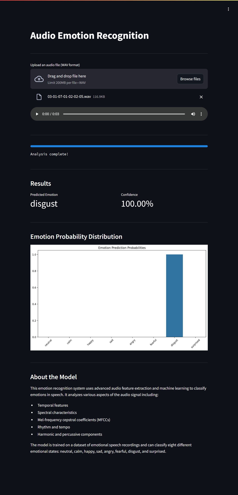

# Audio Emotion Recognition



## Project Overview

The Audio Emotion Recognition project is a machine learning-powered application that identifies emotions in audio files based on their acoustic features. Using a sophisticated machine learning model trained on RAVDESS dataset, it provides accurate emotion classification for audio files.

The application analyzes various acoustic features through advanced signal processing techniques to identify emotional patterns in speech, providing a comprehensive analysis of emotional content.

### Emotion Categories

| Emotion ID | Category  | Description |
|------------|-----------|-------------|
| 01         | Neutral   | Baseline emotional state |
| 02         | Calm      | Peaceful and relaxed |
| 03         | Happy     | Joyful and positive |
| 04         | Sad       | Melancholic and down |
| 05         | Angry     | Strong negative emotion |
| 06         | Fearful   | Anxious and scared |
| 07         | Disgust   | Strong aversion |
| 08         | Surprised | Unexpected reaction |

### Feature Extraction

The system extracts a comprehensive set of audio features for emotion recognition:

1. **Time Domain Features**
   - Mean absolute value
   - Standard deviation
   - Peak amplitude
   - Signal energy
   - Root Mean Square (RMS)
   - Skewness
   - Kurtosis
   - Zero crossing rate
   - 90th percentile of amplitude

2. **Spectral Features**
   - Mean spectral energy
   - Spectral standard deviation
   - Spectral skewness
   - Spectral kurtosis
   - Spectral roll-off (10th and 90th percentiles)
   - Spectral centroid
   - Spectral bandwidth
   - Spectral roll-off

3. **MFCC Features** (Mel-frequency cepstral coefficients)
   - 40 MFCCs
   - Delta MFCCs (first derivative)
   - Delta-Delta MFCCs (second derivative)
   - Statistical measures for each MFCC:
     - Mean
     - Standard deviation
     - Skewness
     - Kurtosis

4. **Rhythm Features**
   - Tempo estimation
   - Beat density
   - Beat regularity
   - Onset strength

5. **Harmonic and Percussive Components**
   - Harmonic mean and standard deviation
   - Percussive mean and standard deviation

6. **Mel Spectrogram Features**
   - Mean mel energy
   - Standard deviation of mel bands
   - Maximum mel energy
   - Minimum mel energy
   - Analysis across 128 mel bands

## Table of Contents

1. [Dataset](#dataset)
2. [Model Architecture](#model-architecture)
3. [Streamlit Application](#streamlit-application)
4. [Deployment Options](#deployment-options)
5. [File Structure](#file-structure)
6. [Usage](#usage)
7. [License](#license)

## Dataset

The model is trained on the RAVDESS dataset, which includes:
- Professional actors (male and female)
- Various emotional expressions
- High-quality audio recordings
- Controlled recording conditions

Dataset can be downloaded from [here](https://drive.google.com/file/d/1wWsrN2Ep7x6lWqOXfr4rpKGYrJhWc8z7/view).

Note: The trained model file (`emotion_classification.joblib`) is not included in this repository due to size limitations.

## Model Architecture

The model employs advanced feature extraction and machine learning:
- Comprehensive audio feature extraction (1020 features)
- Robust preprocessing pipeline
- Advanced classification algorithms with SMOTE balancing
- Feature scaling and PCA dimensionality reduction
- Neural network architecture with adaptive learning rate

The model training process is detailed in the Jupyter notebook:
- `Emotion_Recognition.ipynb`: Data preprocessing, model development, and training

## Streamlit Application

The application (`app/app.py`) provides an intuitive interface for:
- Real-time audio emotion classification
- Visual representation of prediction probabilities
- Interactive audio playback
- Detailed emotion confidence scores
- Automatic feature extraction and analysis

Key features:
- Support for WAV audio files
- Real-time processing and analysis
- Interactive visualization of results
- Comprehensive emotion probability distribution
- User-friendly interface with progress tracking

## Deployment Options Detailed Guide

### 1. Local Deployment
First ensure you have Python 3.8+ installed on your system:
```bash
git clone https://github.com/pouryare/emotion-recognition.git
cd emotion-recognition/app
python -m venv venv
source venv/bin/activate  # On Windows use `venv\Scripts\activate`
pip install -r requirements.txt
streamlit run app.py
```
Access at `http://localhost:8501`

### 2. Docker Deployment
Ensure Docker is installed. Two options:

a) Pull and run the pre-built image:
```bash
docker pull pouryare/emotion-recognition:latest
docker run -p 8501:8501 pouryare/emotion-recognition:latest
```

b) Build and run locally:
```bash
cd app
docker build -t emotion-recognition:latest .
docker run -p 8501:8501 emotion-recognition:latest
```
Access at `http://localhost:8501`

### 3. Heroku Deployment
Prerequisites:
- Heroku account
- Heroku CLI installed
- Git installed

Steps:
```bash
heroku login
heroku create emotion-recognition
heroku buildpacks:add --index 1 heroku/python
heroku buildpacks:add --index 2 https://github.com/heroku/heroku-buildpack-apt
git push heroku main
```

### 4. AWS EC2 Deployment
Prerequisites:
- AWS account
- EC2 instance running Amazon Linux 2
- SSH access

Steps:
1. Connect to EC2:
```bash
ssh -i your-key.pem ec2-user@your-instance-ip
```

2. Install dependencies:
```bash
sudo yum update -y
sudo yum install git python3 python3-pip -y
```

3. Setup application:
```bash
git clone https://github.com/pouryare/emotion-recognition.git
cd emotion-recognition/app
pip3 install -r requirements.txt
streamlit run app.py
```

4. Configure security group (port 8501)

### 5. Google Cloud Platform Deployment
Prerequisites:
- Google Cloud account
- Google Cloud SDK installed
- Project created

Steps:
```bash
gcloud init
gcloud app create
gcloud app deploy
gcloud app browse
```

### 6. Microsoft Azure Deployment
Prerequisites:
- Azure account
- Azure CLI installed
- Resource group created

Steps:
```bash
az webapp create --resource-group myResourceGroup \
                 --plan myAppServicePlan \
                 --name emotion-recognition \
                 --runtime "PYTHON|3.8"

az webapp deployment source config \
    --name emotion-recognition \
    --resource-group myResourceGroup \
    --repo-url https://github.com/pouryare/emotion-recognition.git \
    --branch main \
    --manual-integration
```

## File Structure
```
emotion-recognition/
├── app/
│   ├── app.py
│   ├── app.yaml
│   ├── Dockerfile
│   ├── Procfile
│   ├── requirements.txt
│   ├── setup.py
│   └── setup.sh
├── Emotion_Recognition.ipynb
├── README.md
└── screenshot.png
```

## Usage

1. Access the application through your preferred deployment method
2. Upload an audio file (WAV format)
3. View the audio playback and automatic analysis
4. Explore emotion prediction results:
   - Primary emotion classification
   - Confidence scores
   - Probability distribution visualization
   - Feature extraction insights

The application automatically processes:
- Audio feature extraction (1020 features)
- Real-time analysis
- Probability calculation
- Results visualization

## License

This project is licensed under the MIT License. See the [MIT License](https://opensource.org/licenses/MIT) page for details.

---

For issues or suggestions, please open an issue on the [GitHub repository](https://github.com/pouryare/emotion-recognition).

This project demonstrates the power of machine learning in emotion recognition, providing an accessible tool for automated audio emotion analysis. Through comprehensive feature extraction and advanced machine learning techniques, it offers accurate emotion classification for audio content. Whether you're a researcher, developer, or ML enthusiast, this tool offers practical insights into emotion classification through audio analysis.
